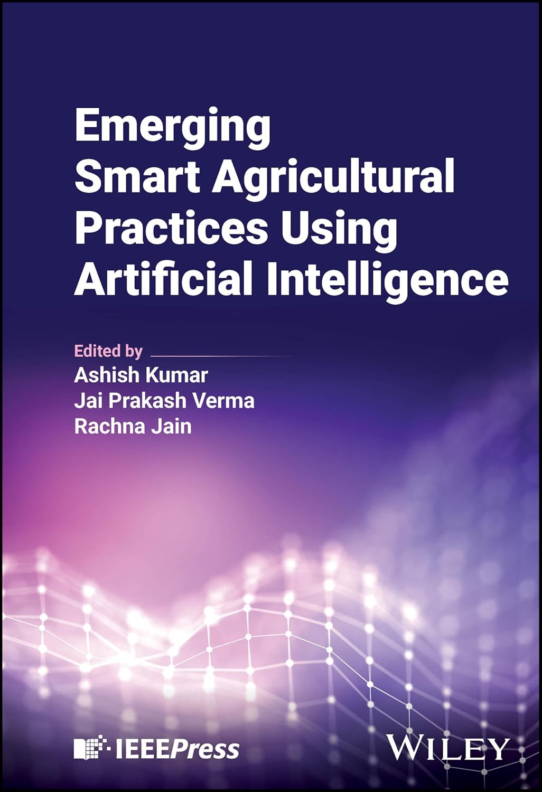

# Foundations of Agricultural AI

  

Research Paper : [**Link**](https://onlinelibrary.wiley.com/doi/abs/10.1002/9781394274277.ch5/)

This repository highlights my contribution to the chapter **"Foundations of Agricultural AI"** in the Wiley publication ***Emerging Smart Agricultural Practices Using Artificial Intelligence***.

The chapter explores the growing role of Artificial Intelligence (AI) in modern agriculture and its potential to improve productivity, sustainability, and decision-making. It examines how AI-driven technologies are being used to monitor soil conditions, assess crop health, optimize planting strategies, analyze agricultural data, and support efficient resource management.

## Publication Details

* **Book Title:** Emerging Smart Agricultural Practices Using Artificial Intelligence
* **Publisher:** Wiley
* **Chapter:** Foundations of Agricultural AI
* **Role:** Contributing Author

## Key Contributions

* Conducted a comprehensive review of AI applications in agriculture and smart farming systems.
* Analyzed how AI supports **soil quality assessment** and provides recommendations for fertilizer usage and soil improvement.
* Explored AI-powered **crop health monitoring systems** that help farmers identify nutrient deficiencies and improve crop quality.
* Investigated advanced technologies such as **hyperspectral imaging** and **3D laser scanning** for accurate crop monitoring and analysis.
* Examined the use of AI for **weather forecasting, seed selection, and planting optimization** to support data-driven agricultural decisions.
* Evaluated the impact of AI on increasing farming efficiency, improving crop yield, reducing waste, and promoting sustainable agricultural practices.

## Technologies and Concepts Covered

* Artificial Intelligence (AI)
* Machine Learning (ML)
* Precision Agriculture
* Agricultural Data Analytics
* Computer Vision
* Hyperspectral Imaging
* Predictive Analytics
* Soil Health Assessment
* Crop Health Monitoring
* Smart Farming Systems

## Impact

The study highlights how AI enables farmers to leverage real-time data and advanced analytics for informed decision-making. By optimizing resource utilization, enhancing crop management, and reducing environmental impact, AI is helping shape the future of sustainable and intelligent agriculture.

## Author Contribution

Contributed to the research, analysis, and writing of the chapter, with a focus on AI-driven data analysis, soil quality monitoring, crop health assessment, precision agriculture technologies, and their role in improving farming efficiency and agricultural productivity.

## Citation

**Emerging Smart Agricultural Practices Using Artificial Intelligence**
*Wiley Publishing*
